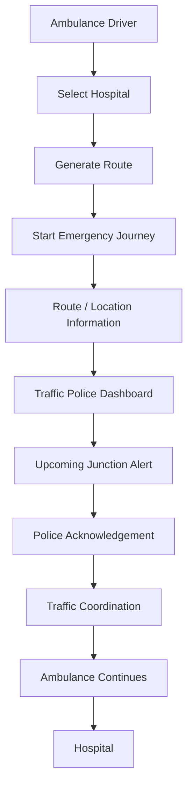
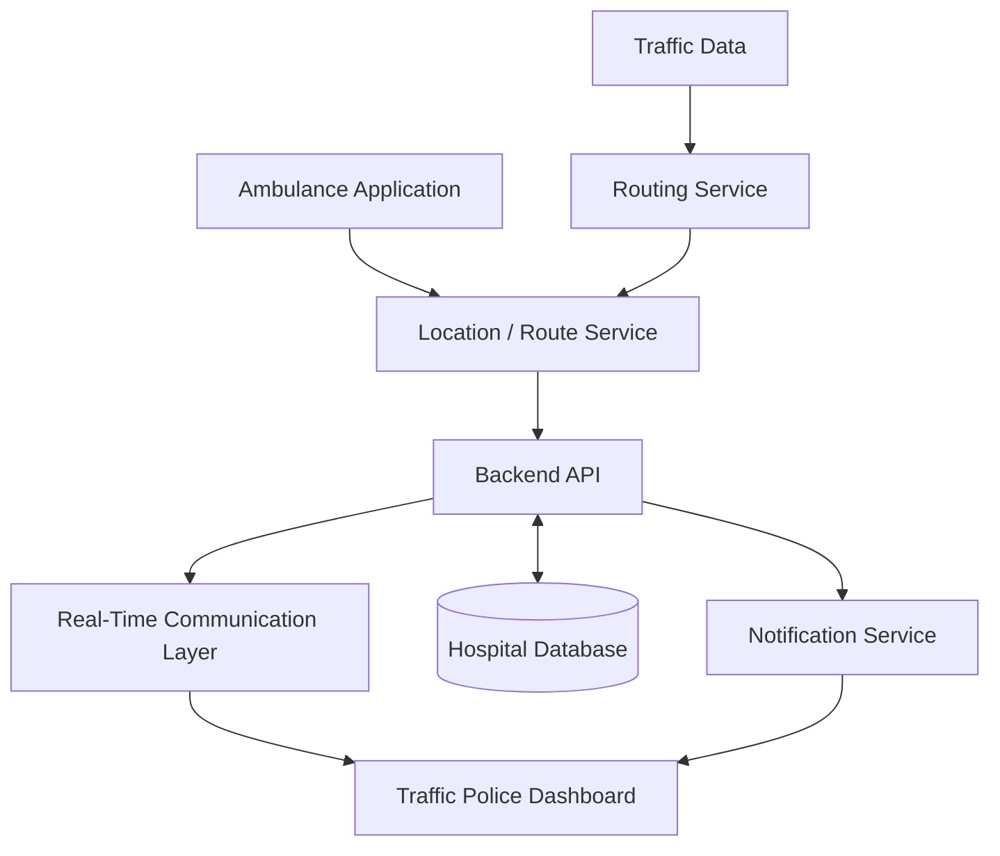

# RapidRoute

**Ambulance navigation, with route visibility and advance alerts for traffic police.**

**Live Demo:** [AWS PartyRock Demo](https://partyrock.aws/u/abbasnotfound/PoiHsijw5/RapidRoute-Emergency-Ambulance-Traffic-Coordination-System)

> **Prototype notice:** RapidRoute is a proof of concept built with AWS PartyRock for a hackathon. It does not track real vehicles, control traffic signals, or connect to any police or emergency system. See [Limitations](#️-limitations) and [Current Prototype](#-current-prototype) for details.

---

## 🚨 Problem

Getting an ambulance through congested roads is a coordination problem as much as a navigation problem.

- The ambulance driver has a route and knows where they are going.
- Traffic police at the junctions along that route usually don't know an ambulance is coming until it is already close.
- That makes traffic handling reactive: officers respond to what they can see, instead of preparing for what is about to arrive.

Navigation tells the driver where to go. It doesn't tell anyone else along the way.

## 💡 Solution

RapidRoute is a proposed coordination layer that sits between the ambulance and the people managing traffic.

**Ambulance navigation + real-time route visibility + traffic-police alerts**

1. The ambulance driver picks a hospital and starts an emergency journey.
2. The planned route and journey information are shared with a traffic police dashboard.
3. Officers see which ambulances are active and which junctions are coming up on their route.
4. When an ambulance is approaching a junction, the officer gets an alert and acknowledges it.
5. The junction status updates, so everyone can see whether it is approaching, being prepared, or cleared.

Instead of navigation being available only to the ambulance driver, RapidRoute gives traffic authorities advance visibility of the ambulance's route.

## 🎯 Key Features

### Ambulance Driver

- **Hospital destination selection**: choose where the ambulance is headed
- **Emergency route visualization**: see the proposed route on a map
- **ETA / distance information**: estimated travel details for the journey
- **Emergency route activation**: start the emergency journey with a single action
- **Roadblock reporting**: flag roadblocks or traffic issues along the way

### Traffic Police

- **Active ambulance monitoring**: see which ambulances are currently on emergency journeys
- **Route visibility**: view each ambulance's planned route
- **Upcoming junction monitoring**: know which junctions the ambulance will reach next
- **Emergency alerts**: get notified when an ambulance is approaching
- **Alert acknowledgement**: confirm the alert has been seen
- **Junction status tracking**: follow each junction through _approaching_, _preparing_, and _cleared_

## 🔄 How It Works

## 🖥️ Prototype Interfaces

The prototype has two interfaces, one for each role.

### Ambulance Dashboard

The driver's view is built around getting a journey started quickly and keeping it simple once it is running.

- **Navigation map** showing the proposed route
- **Destination** hospital
- **ETA** and travel information
- **Route status** for the current journey
- **Emergency controls** to start the journey and report roadblocks

### Traffic Police Dashboard

The officer's view is built around what is coming and what needs attention.

- **Active ambulance view** of journeys currently in progress
- **Route** the ambulance is expected to take
- **Upcoming junctions** along that route
- **Emergency alerts** when an ambulance is approaching
- **Junction status** (approaching, preparing, cleared)

### Emergency Alert

When an ambulance is approaching a junction, the police dashboard shows an **AMBULANCE APPROACHING** alert. It contains:

- **Junction** the ambulance is approaching
- **Ambulance ID**
- **ETA** to the junction
- **Destination** hospital
- **Acknowledge** action for the officer

## 🧭 Demo Workflow

If you are reviewing the live demo, this is the sequence to follow:

1. **Select Ambulance Driver** as the role.
2. **Select a destination hospital.**
3. **Start the emergency route.**
4. **View the route and journey information** (map, ETA, status).
5. **Switch to the Traffic Police interface.**
6. **View the active ambulance** and its route.
7. **The ambulance approaches a junction.**
8. **Police receives an emergency alert** ("AMBULANCE APPROACHING").
9. **Police acknowledges the alert.**
10. **The junction status changes** (for example, from approaching to preparing or cleared).
11. **The ambulance continues toward the hospital.**

In short: the driver starts a journey, police see it coming, get an alert at the junction, acknowledge it, and the junction status updates.

## 🏗️ Proposed System Architecture

**Proposed Production Architecture**

> This is the intended design for a real implementation. **None of these components exist in the current PartyRock prototype.**

| Component                     | Role                                                                              |
| ----------------------------- | --------------------------------------------------------------------------------- |
| Ambulance Application         | Driver interface for destination selection, route display, and emergency controls |
| Location / Route Service      | Receives the ambulance's position and journey, and requests routes                |
| Routing Service               | Calculates routes between the ambulance and the hospital                          |
| Traffic Data                  | Feeds current road conditions into route calculation                              |
| Backend API                   | Central point for journeys, junction status, alerts, and access control           |
| Hospital Database             | Stores hospital locations and related details                                     |
| Real-Time Communication Layer | Pushes journey and status updates to the police dashboard as they happen          |
| Notification Service          | Delivers alerts when an ambulance is approaching a junction                       |
| Traffic Police Dashboard      | Officer interface for monitoring, alerts, and acknowledgement                     |

## 🧪 Current Prototype

| Component                  | Current Prototype                                                                     | Future Implementation                                               |
| -------------------------- | ------------------------------------------------------------------------------------- | ------------------------------------------------------------------- |
| UI                         | Ambulance and police interfaces built in AWS PartyRock to demonstrate the workflow    | Production web/mobile apps designed with emergency-service users    |
| Routing                    | Route shown in the interface to demonstrate the concept; not guaranteed to be optimal | Routing service using a maps/routing API, with dynamic re-routing   |
| GPS tracking               | Not implemented; journey progress is demonstrated, not tracked from a real device     | Live location from ambulance devices                                |
| Backend                    | No dedicated backend; runs within PartyRock                                           | API layer managing journeys, junctions, alerts, and users           |
| Database                   | No persistent database of hospitals or journeys                                       | Managed cloud database for hospitals, journeys, and event history   |
| Real-time communication    | Not implemented; the demo simulates the hand-off between the two interfaces           | WebSockets or a managed real-time service                           |
| Police alerts              | Alert experience demonstrated in the interface                                        | Geofence-triggered alerts delivered by push notification            |
| Traffic signal integration | None                                                                                  | Integration with intelligent traffic signal systems where supported |
| Authentication             | None                                                                                  | Role-based authentication for drivers, officers, and administrators |

## 🚀 Future Scope

None of the following is implemented today.

- **Real-time GPS tracking** of ambulances during a journey
- **Dynamic route optimization** that adapts to changing conditions
- **Geofencing around traffic junctions** to trigger alerts automatically
- **Real-time traffic data integration** for route calculation and ETA
- **Push notifications** so officers are alerted without watching a screen
- **Secure authentication** with separate roles for drivers and police
- **Ambulance fleet management** across multiple vehicles and stations
- **Hospital capacity and availability information** to inform destination choice
- **Integration with intelligent traffic signals** where the infrastructure supports it
- **Traffic police command-center integration** with existing workflows
- **Analytics** on emergency routes and response times

## ☁️ AWS / Technology

The current prototype was created using AWS PartyRock.

**Current Prototype Technology**

- AWS PartyRock

**Potential Production Stack** _(proposed, not implemented)_

| Layer                   | Option                                    |
| ----------------------- | ----------------------------------------- |
| Frontend                | React / Next.js or Flutter                |
| Backend                 | AWS services behind an API layer          |
| Database                | Managed cloud database                    |
| Real-time communication | WebSockets or a managed real-time service |
| Maps / routing          | Appropriate mapping and routing APIs      |
| Notifications           | Push notification service                 |

## 🧠 Design Decisions

**Why two separate interfaces?**

The ambulance driver and the traffic officer have different jobs, and they need different information at different moments. A single shared screen would compromise both.

- **Different information needs.** The driver needs the route, destination, and ETA. The officer needs to know which ambulances are active, where they are heading, and which junction is next.
- **Low cognitive load for drivers.** The ambulance interface is kept focused on a small number of things: destination, route, and emergency controls.
- **Minimal interaction while driving.** Starting a journey and reporting a roadblock should take as few actions as possible.
- **High-visibility alerts for police.** The approaching-ambulance alert is meant to stand out and be acted on quickly, with the key details (junction, ambulance ID, ETA, destination) visible at a glance.
- **Clear status indicators.** Junction states (approaching, preparing, cleared) let an officer see what needs attention without reading details.
- **Route visibility for coordination.** Showing the planned route lets traffic authorities prepare ahead of the ambulance instead of reacting when it arrives.

## ⚠️ Limitations

RapidRoute is a hackathon prototype. It demonstrates an idea and a user experience, and it should not be treated as an emergency system.

A real deployment would require, at minimum:

- Government and traffic authority integration
- Data privacy and security
- Reliable GPS and location infrastructure
- Emergency-service validation
- High availability
- Authentication and authorization
- Extensive testing
- Legal and operational approvals

## 👥 Hackathon Project

RapidRoute was developed as a hackathon concept and prototype.

- **Team members:** _to be added_
- **Hackathon:** _to be added_
- **Date:** _to be added_

## 📄 License

License information will be added as the project moves toward implementation.
